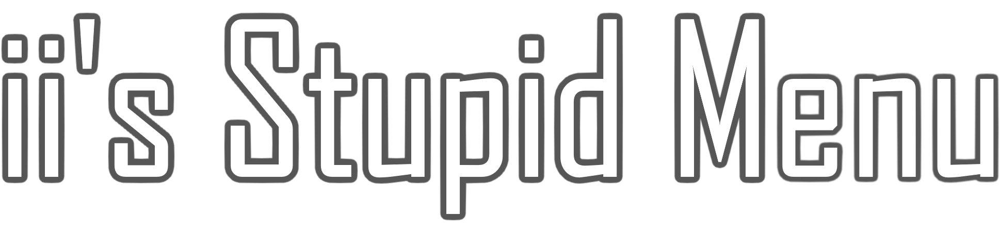
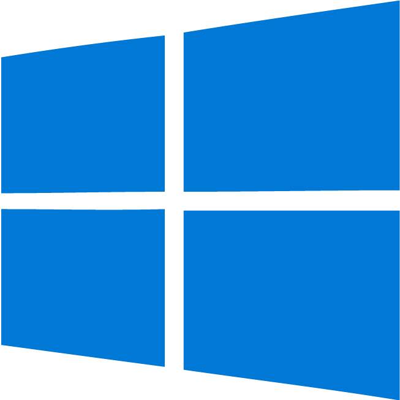
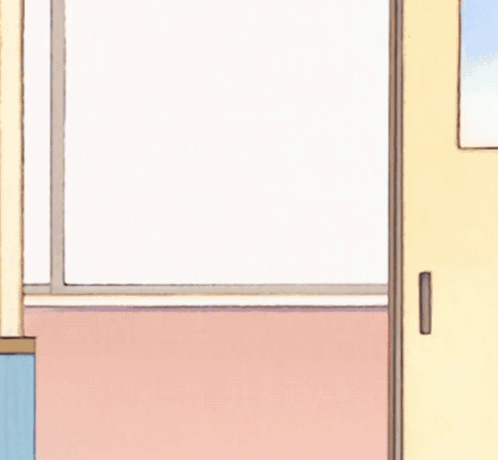

  
  

---

	
	
	

---

#  ii's Stupid Menu  

ii's Stupid Menu is a **feature-packed** mod menu for Gorilla Tag, built by me, [**iiDk**](https://github.com/iiDk-the-actual). Whether you just want mods, are a developer, or anything inbetween, this menu has you covered. Designed to be **as useful as possible**, it includes a variety of features and options that let you customize your modding experience to your heart’s content.  

> Why settle for boring when you can have *stupidly* good?  

## 💡 Why open-source?  

Great question. The modding community used to be about **sharing, learning, and improving** together. But nowadays, everything’s locked behind **paywalls and obfuscation**. That’s not how it should be.  

By making this menu open-source, I'm giving **everyone** the opportunity to:  
- Learn how mod menus work 
- Experiment with new ideas  
- Contribute to the Gorilla Tag modding scene  
- ⭐ **Keep modding free and accessible**  

Let's bring back the collaboration of modding. No paywalls, no secrets, no malware, just good mods.  

## ❓ Can I use your code?  

Of course! But there’s a catch: you gotta play fair. **[GPL-3.0 License](https://www.gnu.org/licenses/gpl-3.0.html) rules apply**, which means that if you use my code:  
- Your project **must** also be open-source.  
- Give credit where it's due.
- No shady stuff.
- **[Follow the license.](https://www.gnu.org/licenses/gpl-3.0.html)**

> "You wouldn’t steal a method." 
> [🎥 *(Or would you?)*](https://www.youtube.com/watch?v=zMBqPdMzZ9E)

# 🎛️ System Compatibility
| Operating System | Menu | Fonts | Images | Sounds | Videos |
|------------------|------|--------|--------|--------|--------|
| Windows 10|✅|✅|✅|✅|✅|
| Windows 11|✅|✅|✅|✅|✅|
| Mac OS|✅|✅|✅|✅|❌|
| Linux|✅|❌|✅|✅|❌|

---

# 📥 Installation  

1. **Download** the latest release **[here](https://github.com/iiDk-the-actual/iis.Stupid.Menu/releases/latest)**
2. **Drag & Drop** `iis_Stupid_Menu.dll` into your plugins folder  
3. **Launch** Gorilla Tag and enjoy!

## 🧱 From Source Code (for developers!)

1. Download the source code **[here](https://github.com/iiDk-the-actual/iis.Stupid.Menu/releases/latest)**
2. Edit `Directory.Build.props` and update `<GamePath>` if your Gorilla Tag is in a custom spot 🛠️
3. Build the project with `Ctrl + Shift + B` 
✅ The DLL will automatically go into your Gorilla Tag plugins folder

---

# 🗣️ Contact Information

Need help or want to collaborate? Contact me from the links on my **[website](https://iidk.dev)** or join the **[Discord server](https://discord.gg/iidk)**.  
Feel like something is missing? Become a **[contributor](https://github.com/iiDk-the-actual/iis.Stupid.Menu/?tab=contributing-ov-file)**!

# ❤️ Support

If you wish to support me, here are some of the ways you can!

| Platform   | Link | Address |
|------------|------|---------|
| Bitcoin    |  | [bc1qtmrqtq4ag720tvux64ff3rjp632jy2d447p3nx](bitcoin:bc1qtmrqtq4ag720tvux64ff3rjp632jy2d447p3nx) |
| Ethereum   |  | [0xa1A78771422F602d9Ded0E8373d5A3D77E146877](ethereum:0xa1A78771422F602d9Ded0E8373d5A3D77E146877) |
| Litecoin   |  | [LaoNB7KADaGGb5ik8RhEBhAFdhM9pu5se5](litecoin:LaoNB7KADaGGb5ik8RhEBhAFdhM9pu5se5) |
| XRP        |  | [rpLLN1Gse5zFnVxwQkMvh6jvKKtPrAjvLV](xrp:rpLLN1Gse5zFnVxwQkMvh6jvKKtPrAjvLV) |
| Patreon    |  | [iiDk](https://www.patreon.com/iiDk) |
| CashApp    |  | [$iiWasHere](https://cash.app/$iiWasHere) |

> [!NOTE] 
> This product is not affiliated with Gorilla Tag or Another Axiom LLC and is not endorsed or otherwise sponsored by Another Axiom LLC. Portions of the materials contained herein are property of Another Axiom LLC. © 2025 Another Axiom LLC. 
> Menu sends requests to [https://iidk.online](https://github.com/iiDk-the-actual/iidk.online) for telemetry, administrative and TTS (text to speech) purposes. 
> Menu also sends requests to https://text.pollinations.ai for the mod **AI Assistant**. (when enabled) 
> Menu connects to [wss://iidk.online](https://github.com/iiDk-the-actual/iidk.online) for friend system and administrative purposes. 
> Donate, search, star, speak symbols by [Icons8](https://icons8.com).

> ii's Stupid Menu  README.md 
> A mod menu for Gorilla Tag with over 1000+ mods
>
> Copyright (C) 2025  Goldentrophy Software
> https://github.com/iiDk-the-actual/iis.Stupid.Menu
> 
> This program is free software: you can redistribute it and/or modify
> it under the terms of the GNU General Public License as published by
> the Free Software Foundation, either version 3 of the License, or
> (at your option) any later version.
> 
> This program is distributed in the hope that it will be useful,
> but WITHOUT ANY WARRANTY; without even the implied warranty of
> MERCHANTABILITY or FITNESS FOR A PARTICULAR PURPOSE.  See the
> GNU General Public License for more details.
> 
> You should have received a copy of the GNU General Public License
> along with this program.  If not, see <https://www.gnu.org/licenses/>.

  

